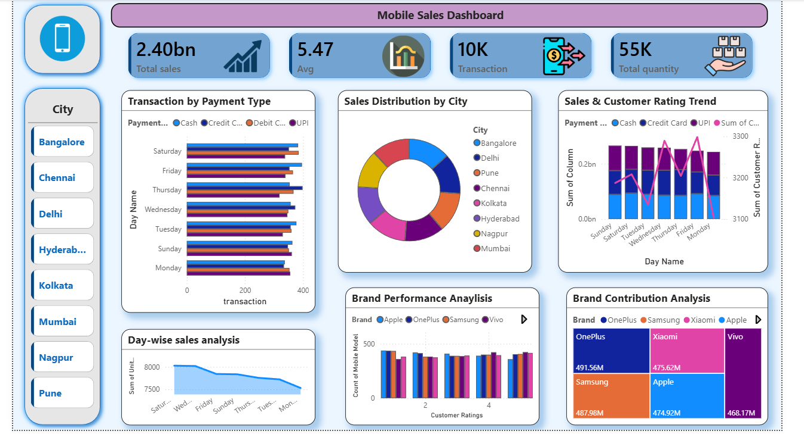

# Mobile Sales Dashboard

## Project Overview
This Power BI dashboard analyzes mobile sales performance across different cities, payment methods, and brands.

## Features
- Sales KPI tracking
- Revenue trend analysis
- Customer rating analysis
- Brand contribution analysis
- Interactive slicers and filters
- City-wise sales insights

## Tools Used
- Power BI
- Excel Dataset
- Data Visualization
- DAX

## Dashboard Preview

## Key Insights
- UPI and Credit Card payments showed high transaction volume
- OnePlus and Samsung contributed highest sales
- Weekend sales were higher compared to weekdays

## Files Included
- .pbix Power BI project file
- Dashboard screenshot
- README documentation

## Author
Rushi Ambore# mobile-sales-dashboard
Interactive Power BI dashboard for mobile sales analysis
